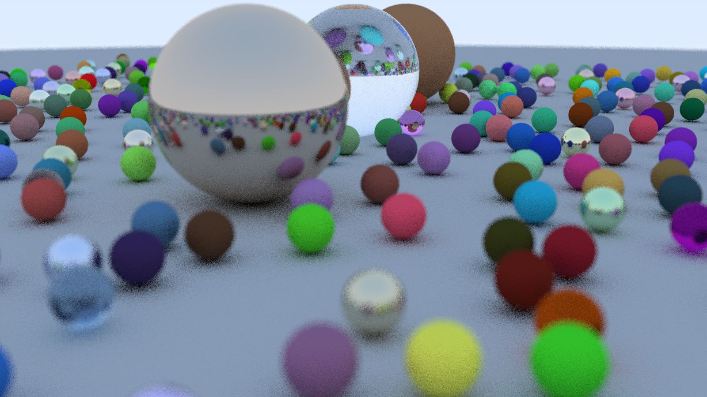

# PathTracer

Based on [Ray Tracing in One Weekend Series](https://raytracing.github.io/) by Peter Shirley

Supplemental information from [Victor Li's blog](http://viclw17.github.io/)

## Branches
<details>
<summary>the-first-weekend</summary>
<br>
This is the first of three books in the <a href=https://raytracing.github.io/>"Ray Tracing in One Weekend Series"</a> by Peter Shirley. Topics covered from beginning to end include:


- Outputting an image (.ppm file)
- Using vectors to represent the world and its properties
- Rays, a simple camera, and a background
- Producing a sphere
- Surface normals, multiple hittable objects
- Anti-aliasing
- Diffuse materials
- Metallic materials
- Dielectric materials
- Positionable Camera
- Depth-of-field blur




</details>

<details><summary>the-next-week</summary>
<br>
This is the second of three books in the <a href=https://raytracing.github.io/>"Ray Tracing in One Weekend Series"</a> by Peter Shirley. Topics covered from beginning to end include:

- Motion Blur
- Bounding Volume Hierarchies
- Solid Textures
- Perlin Noise
- Image Texture Mapping
- Rectangles and Lights
- Instances
- Volumes

</details>

<details>
<summary>the-rest-of-your-life</summary>
<br>
The final book in the <a href=https://raytracing.github.io/>"Ray Tracing in One Weekend Series"</a> by Peter Shirley. Topics covered from beginning to end include:

  - A Simple Monte Carlo Program
  - One Dimensional MC Integration
  - MC Integration on the Sphere of Directions
  - Light Scattering
  - Importance Sampling Materials
  - Generating Random Directions
  - Orthonormal Bases
  - Sampling Lights Directly
  - Mixture Densities
  - Some Architectural Decisions
  - Cleaning Up PDF Management
</details>

# Usage
Compile Main.cpp (or run `make`)and pipe the output of the resulting executable into a .ppm file:

```
./a.out > image.ppm
```
